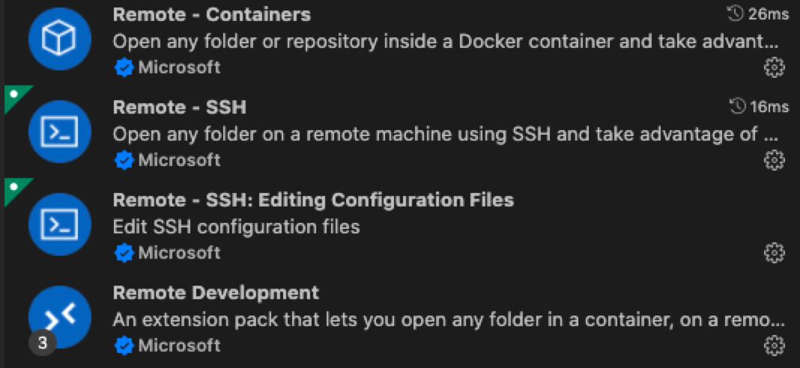
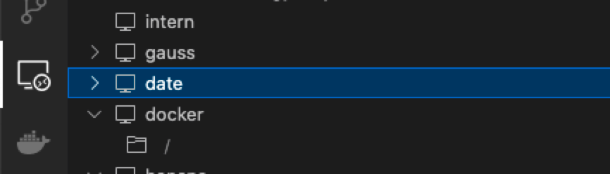
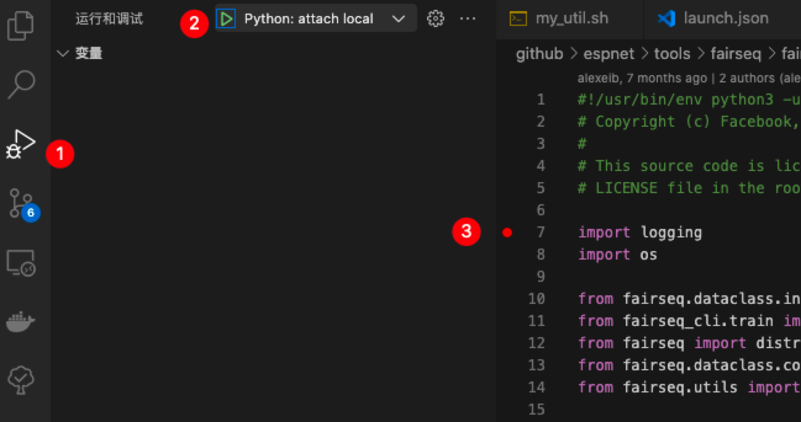
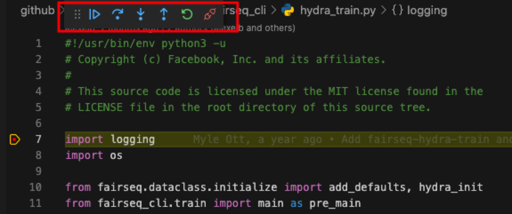

# An Intro to set up your Docker environment and debug using VSCode

> Created by Ziyang on 2021.12.20
>
> Based on SJTU-XLANCE Servers & speech pre-train docker as examples. 


## Set up VSCode Remote

1. Download extensions in VSCode. 



2. Set up config of multi-jumps. (For you need a jumping machine to get access the GPUs.) 

```bash
# local at ~/.ssh/config
Host gauss
    HostName 202.xxx.xxx.xxx
    Port 5566
    User zym22
Host date
    HostName 192.xxx.xxx.xxx
    # ProxyJump gauss
    ProxyCommand ssh -A gauss -W %h:%p
    User zym22
```

3. Connect to the Server such as `date`. 




## Set up Docker environment

> Before take steps in this section, make sure your terminal is like `zym22@date:~$`.

1. Set up Docker environment in `zym22@date:~$`.

```bash
docker pull zym22/pre-train:latest 
docker run -it --runtime=nvidia --name myDocker \ # choose a name
    --mount src=/mnt/xlancefs/home/zym22/data,target=/data/zym22,type=bind \ # access to your src
    # -v /mnt/xlancefs/home/zym22:/home/zym22 \
    -p 8023:22 \ # choose a port
    --ipc=host    # host shares memory with the container
    zym22/pre-train:latest /bin/bash
docker start myDocker
docker exec -it myDocker /bin/bash
```

2. Set up Docker environment in `root@myDocker:~$`.

```bash
passwd root
apt update
apt install -y openssh-server
vim /etc/ssh/sshd_config
###
# edit here
Port 22                     #Enabling Port 22
PermitRootLogin yes         #Allow root user to log in using ssh
RSAAuthentication yes       #Enabling RSA Authentication 
PubkeyAuthentication yes    #Enable public-private key pairing Authentication
# wq
###
service ssh restart
exit
```

3. Verify that port mapping is correct. 

```less
zym22@date:~$ docker port myDocker 22
0.0.0.0:8023
```

4. Edit local config at `~/.ssh/config`. 

```bash
# local at ~/.ssh/config
Host gauss
    HostName 202.xxx.xxx.xxx
    Port 5566
    User zym22
Host date
    HostName 192.xxx.xxx.xxx
    # ProxyJump gauss
    ProxyCommand ssh -A gauss -W %h:%p
    User zym22
Host myDocker
    HostName 192.xxx.xxx.xxx # same as date
    Port 8023
    # ProxyJump gauss
    ProxyCommand ssh -A gauss -W %h:%p
    User root
```

5. Connect to the Docker. 


## Debug using VSCode

> Before take steps in this section, make sure your terminal is like `root@myDocker:~$`

1. Create a `launch.json` in `.vscode` folder.

```json
# launch.json
{
    "version": "0.2.0",
    "configurations": [
        {// python -m debugpy --listen 5678 --wait-for-client main.py args
            "name": "Python: attach local",
            "type": "python",
            "request": "attach",
            "console": "integratedTerminal",
            "env": {
                "CUDA_VISIBLE_DEVICES": "1" //edit
            },
            "connect": {
                "host": "localhost",
                "port": 5678 //edit
            }
        }

    ]
}
```

2. Run a python file and block.

```bash
pip install debugpy
python -m debugpy --listen 5678 --wait-for-client main.py args
```

3. Start debugging mode.



